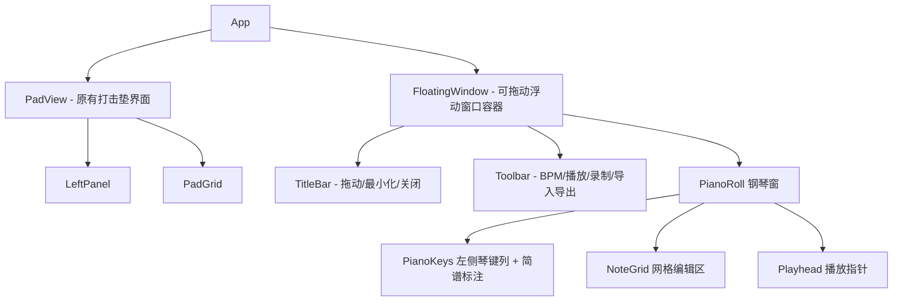

# CalabiYau-Piano 钢琴窗编曲功能计划

## 项目现状

- React 19 + TypeScript + Vite 8 + Tailwind CSS 4 项目
- 16 键打击垫，加载 16 个 ogg 音频文件
- 使用 Web Audio API 播放
- 现有组件：App、PadGrid、Pad、LeftPanel

## 需求总结

1. **钢琴窗编曲** - 基于现有 16 个 pad 音色的 Piano Roll 编辑器
2. **BPM 设置** - 可调节速度
3. **JSON 导出/导入** - 自定义格式保存和加载编曲
4. **播放** - 按时间轴顺序播放编排的音符
5. **录制** - 实时录制 pad 演奏转为音符序列
6. **简谱标注** - 在钢琴窗中显示简谱数字辅助标注

## 架构设计

### 数据模型

```typescript
// 单个音符
interface Note {
  id: string           // 唯一标识
  padId: number        // 1-16，对应 pad 音色
  startBeat: number    // 起始拍（以 beat 为单位，支持小数如 0.25 表示十六分音符）
  duration: number     // 持续拍数
}

// 项目/乐曲
interface Project {
  name: string
  bpm: number          // 默认 120
  beatsPerBar: number  // 每小节拍数，默认 4
  totalBars: number    // 总小节数，默认 8
  notes: Note[]
}
```

### 简谱映射

16 个 pad 映射到简谱标注（用户可在 UI 中看到）：

| Pad 1-7 | → | 低音 1̣ 2̣ 3̣ 4̣ 5̣ 6̣ 7̣ |
|---------|---|----------------------|
| Pad 8   | → | 1（中音 do）          |
| Pad 9-14| → | 2 3 4 5 6 7          |
| Pad 15-16| → | 高音 1̇ 2̇            |

> 注：具体映射可根据实际 ogg 音高调整

### 组件架构

钢琴窗采用**浮动窗口**设计，类似 FL Studio 的 Piano Roll 窗口：
- 可拖动标题栏移动位置
- 可通过边角拖拽调整大小
- 有最小化/关闭按钮
- 窗口内部包含工具栏 + 琴键 + 网格编辑区



### 状态管理

使用 React Context + useReducer 管理全局状态：

```typescript
interface AppState {
  project: Project
  isPlaying: boolean
  isRecording: boolean
  currentBeat: number    // 播放头位置
  selectedTool: 'draw' | 'erase' | 'select'
}
```

### 新增/修改文件清单

| 文件 | 说明 |
|------|------|
| `src/types.ts` | 数据类型定义 |
| `src/context/ProjectContext.tsx` | 全局状态管理 |
| `src/components/FloatingWindow.tsx` | 可拖动/缩放的浮动窗口容器 |
| `src/components/PianoRollToolbar.tsx` | 钢琴窗内工具栏（BPM/播放/录制/导入导出） |
| `src/components/PianoRoll.tsx` | 钢琴窗主组件 |
| `src/components/PianoKeys.tsx` | 钢琴窗左侧琴键列 |
| `src/components/NoteGrid.tsx` | 钢琴窗网格编辑区 |
| `src/hooks/useDraggable.ts` | 拖动窗口 hook |
| `src/hooks/useResizable.ts` | 缩放窗口 hook |
| `src/utils/playback.ts` | 播放引擎 |
| `src/utils/recorder.ts` | 录制逻辑 |
| `src/utils/fileIO.ts` | JSON 导入导出 |
| `src/utils/jianpu.ts` | 简谱映射工具 |
| `src/App.tsx` | 修改 - 整合浮动窗口 |

### 外部依赖

- **uuid**（或 crypto.randomUUID）：生成音符 ID
- 不需要额外音频库，继续使用原生 Web Audio API

## 实施步骤

### 第一阶段：基础架构
1. 定义数据类型 `src/types.ts`
2. 创建 `src/context/ProjectContext.tsx` 全局状态管理
3. 创建简谱映射工具 `src/utils/jianpu.ts`

### 第二阶段：浮动窗口 + 钢琴窗 UI
4. 实现 `src/hooks/useDraggable.ts` 和 `src/hooks/useResizable.ts`
5. 实现 `src/components/FloatingWindow.tsx`（可拖动/缩放/最小化/关闭）
6. 实现 `src/components/PianoKeys.tsx`（左侧 16 行琴键 + 简谱标注）
7. 实现 `src/components/NoteGrid.tsx`（网格 + 音符绘制/删除）
8. 实现 `src/components/PianoRoll.tsx`（组合琴键 + 网格 + 播放头）

### 第三阶段：工具栏与控制
9. 实现 `src/components/PianoRollToolbar.tsx`（BPM、播放/暂停/停止、录制、导入导出）

### 第四阶段：播放与录制
10. 实现播放引擎 `src/utils/playback.ts`（基于 Web Audio API 调度）
11. 实现录制逻辑 `src/utils/recorder.ts`（记录 pad 点击时间戳转为 beat）

### 第五阶段：文件 IO
12. 实现 JSON 导出/导入 `src/utils/fileIO.ts`

### 第六阶段：整合
13. 修改 `src/App.tsx` - 添加打开钢琴窗按钮，整合浮动窗口
